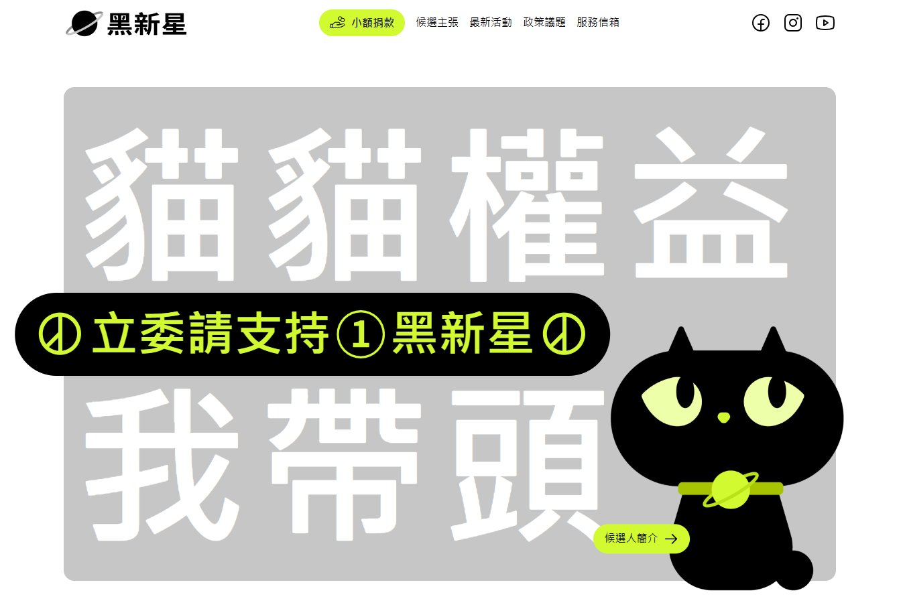

# 2023 THE F2E Mission 1 立委競選官網



[DEMO](https://joy-chang-2021.github.io/2023HexSchool01_CandidateWeb/)

### 專案介紹
此為六角學院 2023 年 THE F2E 精神時光屋活動，主題一：立委競選官網
- 活動官網：[https://2023.thef2e.com/](https://2023.thef2e.com/)
- UI設計個人組：[PinpinChen](https://2023.thef2e.com/users/12061579704054729654)
- 前端個人組：JoyChang/[Family](https://2023.thef2e.com/users/12061579704044466133)

### 專案結構

```shell
├── public/           # 靜態資源
├── src/              # 主要程式碼
│   ├── assets/       # 被編譯的靜態資源
│   │   ├── icons/    # 圖符檔
│   │   ├── images/   # 圖檔
│   ├── components/   # 共用元件
│   │   ├── theme/    # 全域樣式設定檔
│   ├── App.js        # 專案進入點
│   ├── index.js      # 入口文件
└── package.json      # 專案資訊、指令、套件及版本號
```

### 專案工具
- React
- Chakra-ui
- Styled-Components
- react-scroll
- gh-pages

### 開發指令
```bash
# 安裝專案
git clone https://github.com/Joy-Chang-2021/2023HexSchool01_CandidateWeb.git
# 安裝相關套件
npm instal
# 啟動專案
npm run start
```

### 收穫
##### 此次專案嘗試使用、尚待熟練的新設定
- css `aspect-ratio` 固定元素的長寬比例
- css `clamp` 控制文字的尺寸範圍
- svg 顏色動態變化的控制
##### 未來尚待研究運用的效果
- Animation of Scroll 頁面滾動時的動畫效果

